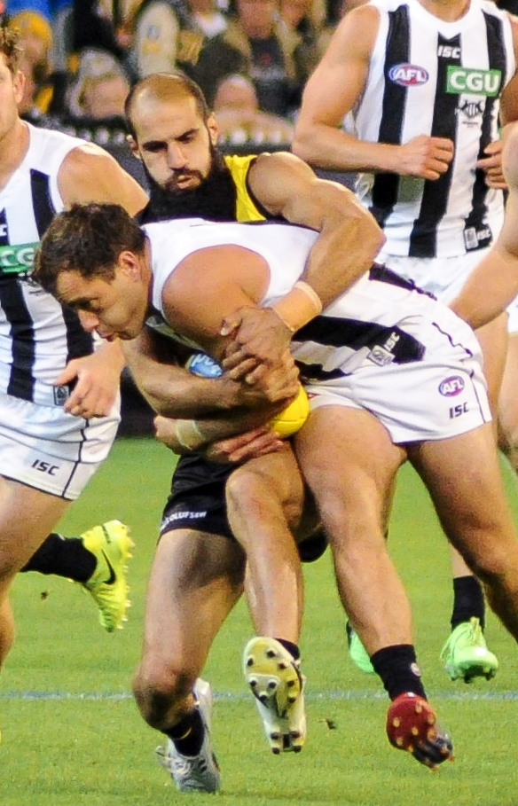
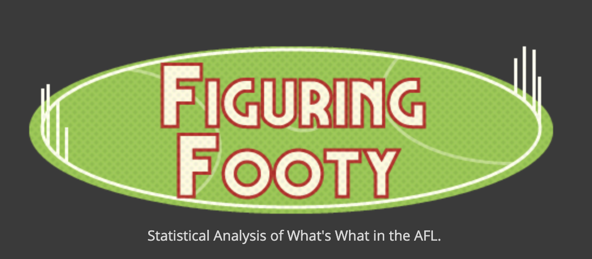
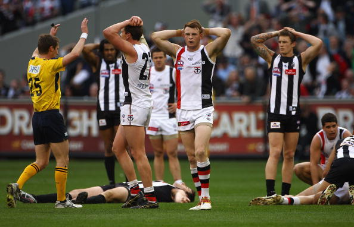
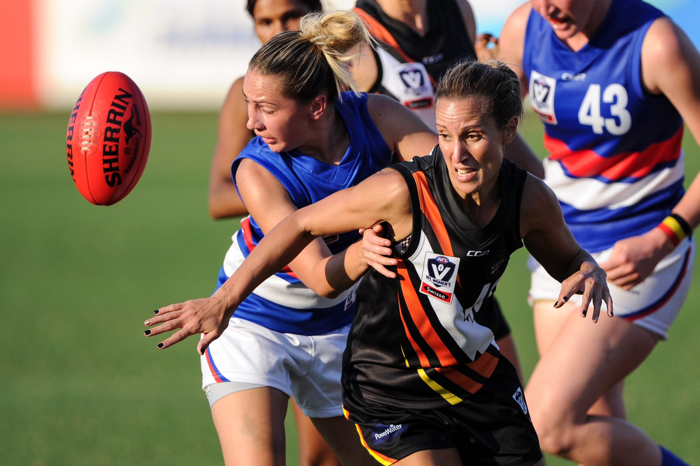

autoscale: true
footer:  @englishcraig


# **Machine Learning<br>Outside the Kaggle Lines**

## Craig Franklin

---

# About me

:department_store: Backend developer at Marketplacer

^ I'm a backend developer at Marketplacer, which is an ecommerce marketplace platform built on Ruby on Rails and React (mostly). I lead the team that works on maintaining and extending client-facing APIs, as well as headless connectors to other ecommerce frontends like Shopify or native mobile apps.

:snake: Weekend pythonista

^ But if I work on a bunch of Ruby APIs, what am I doing here at PyCon talking about machine learning? Though Ruby buys my bread, it is Python data science that feeds my soul.

:rugby_football: Recent convert to Aussie Rules Football fandom

^ And, most importantly for the purposes of this talk, I'm a recently-consecrated fan of Aussie Rules Football.

 tipresias, cfranklin11

:notebook: craigfranklin.dev

 @englishcraig

^ And if you find any of this talk interesting or useful, you can check out the code that makes the magic happen on GitHub at the tipresias account or my personal account. I sometimes write blog posts on my personal site, and I'll definitely upload this presentation there. And I am a hopeless lurker on Twitter.

[.footer:]

---

# Kaggle is fine

# :thumbsup:

^To start, I'm not here to disparage Kaggle or similar data-science competition platforms. They helped me learn the basics of machine learning. They're fine. But they are tightly controlled environments intended to create a space for learning and a level playing field for competition: everyone plays by the same rules, with the same data, and may the best machine-learning enthusiast win. They are the data-science equivalent of sport.

---


^You have the ones without prizes, with people competing for bragging rights, much like recreational leagues in which the weekday desk jockey gets a chance to hipcheck Jesse from Accounts Payable on Saturday.

^You also have the big leagues, the competitions with cash prizes for the winners, where material rewards serve as a motivating factor alongside simple love of the game. If Kaggle competitions are like organised sport,...

^then I'd say a personal machine-learning project is like a casual pick-up game: you never know who will show up from week to week, there are no coaches, no umpires, the goals and boundary lines are all in your imagination, and, most importantly, all rules are merely suggestions. Kaggle is fine, but if it's all you've known it can be a shock to have all the control and responsibility of your own project.

^So, let's lace up those boots, tape up that knee, and snap on our best headband, and get ready for machine learning where our only limit is in how much we want it. And grit.

[.footer: _Photos by Nick Jio, Jeffrey F Lin, and Ruben Leija on Unsplash_<br> @englishcraig]

---

# What is footy (tipping)?


^Most of what I'm going to talk about today I learned from my project developing a machine-learning model to predict the results of Australian Football League (or AFL) matches, so I want to give a little context about the problem that I was trying to solve.

[.footer: *Robert Merkel, Jacknstock at English Wikipedia / Public domain*]

---



^Australian-rules football is a contact sport that uses an oblong ball, similar to rugby and American football. Depending on what part of Australia you're in, 'footy' can refer to this sport. Footy tipping is a popular activity where someone in the office sets up a betting pool, their coworkers have the opportunity to put money in a pot at the beginning of the season, and whoever can predict the most match winners correctly wins the money. I've lived in Australia for about six years, but I'm from the U.S. and knew very little about Australian-rules football when I arrived down under. I don't know what this says about my sense of humour, but I thought it would be funny to build a machine-learning model that was better at predicting AFL match results than the lifelong fans whom I worked with.

^My third season of footy tipping has just begun earlier this month, and the first two seasons involved many novel challenges that I never encountered in machine-learning books or the few competitions that I entered on sites like Kaggle and DrivenData. This meant that I made lots of mistakes during that first season, both in building the model and the application around it. But like any good student, I took note of my errors and worked to avoid them when building my model for the second season, which means I made new mistakes, which is the principle sign of progress for us as coders, isn't it?

[.footer: _By Unknown author - Fairfax Photo Archives, Public Domain<br>By Flickerd - Own work, CC BY-SA 4.0_<br> @englishcraig]

---

# Clearly define your problem


^By the time I started my project, I had lived in Australia for a few years, so I had participated in a few conversations about this strange, local custom known as "footy tipping". I knew that every week you just had to submit your predictions for the winner of each match, and the person who picks the most winners correctly at the end of the season wins. Easy. So, I built a machine-learning model with Scikit-Learn, fed it data from past AFL seasons, tuned it, then embedded it in a Flask app that e-mailed me predicted winners for every round. When it came time to submit my first tips of the season, I went to the tipping website, clicked the radio inputs next to the teams my model claimed would win, but there was a problem, a problem known as an unexpected input...

[.footer: *Photo by Patrick Tomasso on Unsplash*]

---


^In addition to picking winners, I had to enter a predicted margin of victory for the first match of the week. No one had told me about this! It turns out that the difference between your predicted margin and the actual margin of victory is used as a tie-breaker if multiple people get the same number of correct tips. My model was just a classifier picking winners and losers, and there wasn't time to create a whole new regressor to add margin predictions, so I spent the rest of that first season manually looking up the line odds on betting sites in order to be able to submit _something_.

---

## The Kaggle team are here to help


^When you're working on your own problem, as opposed to entering a competition, you don't have a team of people doing background research for you and presenting you with a clear, concise description of the problem your solving and what you need to do in order to solve it. What are the raw inputs, what are the required outputs? Do you want the highest accuracy, the lowest mean-absolute error, the lowest log-loss? Kaggle and other sites do all this work for you, because they want you to be able to focus on the challenge of developing the best possible models, according to their definition of 'best'.

[.footer: _Photo by Science in HD on Unsplash_<br> @englishcraig]

---

## Wait, where'd they go?


^When you're on your own, you have to do your own research in defining the objective, then simplifying it into a problem that a machine-learning model can solve for. My objective was to win the office footy-tipping competition. I though the machine-learning problem was to maximise accuracy when predicting match winners. The _real_ problem, however, was to simultaneously maximise prediction accuracy, which was the primary objective, and minimise the error of the predicted margin, the secondary objective.

^Having learned my lesson, when preparing for my second season of footy tipping, I focused on regressors rather than classifiers, which gave me the benefit of being able to achieve both objectives without needing to maintain two models throughout the AFL season. I could predict the margin of victory for each team with a regressor while implicitly also predicting the winner. If the predicted margin is positive, then that team is the predicted winner, if it's negative, then we expect that team to walk off the field heads hung low in shame.

[.footer: _Photo by Jeremy Bishop on Unsplash_<br> @englishcraig]

---

# Know the entire life stories<br>of your data sources


^Another important difference between Kaggle competitions and personal projects is the number of tasks that you're responsible for. As with defining the problem, Kaggle and others collect that data for you, clean it, serve it to you on their finest porcelain with a sprig of parsley: all you gotta do is build the best model possible before the competition ends. You have a lot of options when determining the scope of your personal project, but at a minimum you have to find your own data sources, import them to your development environment, and clean the data into a condition that your model can use. And heaven help you if you, like me, are working with dynamic data sources that change from week to week, sometimes in unpredictable ways.

^My model uses betting odds for features, which provide a strong signal, because betting companies put a lot of resources into predicting which teams will win and by how much. In my first season, I started by scraping betting data from a site called Footywire. During the training phase, everything went great, I got my data, trained my model. I was ready to go. But less than a week before the first match of the season, the betting data tables were all blank.

[.footer: *Photo by CoWomen on Unsplash*]

---

_Insert screenshot of data table with blank betting odds_

^I panicked. I had no idea when Footywire updated their data. Maybe it wasn't until the day before a match, maybe it was after the match? And what was I going to do without my strongest features? I spent a few days writing a scraper for a betting site to get their odds, and managed to finish before the start of the season, by which time Footywire was finally displaying its aggregated betting odds as I had expected before losing my faith. I realised later, that I had expected betting data by the Monday before matches started on Thursday, but Footywire updates those tables every Tuesday.

---

## Weekly Data Update Schedule

| Day       | Data Types                    | Data Sources  | Notes                                       |
| --------- | ----------------------------- | ------------- | ------------------------------------------- |
| Monday    | Match results<br>Player stats | afltables.com | Sometimes delayed till Tuesday or Wednesday |
| Tuesday   | Betting odds                  | footywire.com |                                             |
| Wednesday | Team rosters                  | afl.com.au    | For Thursday match only                     |
| Thursday  | Team rosters                  | afl.com.au    | For all later matches                       |

^As you can see, each data source has its own schedule for updating data, and even then, they occasionally have off weeks, delaying the release of new data by a day or two. I remember well the great AFL Tables panic of 2019, when all the footy stats aficionados across Australia cried out for fresh data yet none was forthcoming, though the rooster had already crowed the dawn of Wednesday. Thankfully, we got our results and player stats by that evening, leaving the modellers a scant 24 hours to run their models and update their predictions before the first match of the round. You also have to keep in mind that data such as betting odds and team rosters change over the course of the week, so then you have to decide whether to update your predictions daily to keep up with these dynamic factors. As my process is still not fully-automated, I'll only run my model once or twice per week, but there are some who update every day to account for the latest player changes, so it depends on how dedicated you are I guess.

^When importing from data sources that get updated on their own schedules like this, it's important to know those schedules well, especially where exceptions can occur, so you can schedule your imports accordingly. If you try to import data that hasn't been updated yet, at best you'll get an empty response and can try again later; at worst you'll get stale data without realising it, then feed it into your model and get stale predictions in return. Just as you have to occasionally visually examine your data to check for subtle bugs, you should observe your data sources, paying particular attention to when and how they change over time.

---

# Get by with a little help<br>from your friends

^Collecting and cleaning your own data is a lot of work. You have to write web scraping scripts or figure out how to integrate with some poorly-documented, public API, then update your code with every change to the HTML or unversioned schema. How are you ever going to find the time to actually build and tune a model? When I started, I assumed that I was on my own. I'm so very clever and original, surely no one has ever thought of creating a machine-learning model for footy tipping. With that in mind, I found websites with the data I needed, and wrote code to scrape it, and with what little time I had left, I built my model. But I was wrong, so very wrong.

---




^There was a whole community of statistically-minded Australian sports fans who have been doing footy tipping for years. There's a whole website dedicated to it called squiggle.com.au. A university in Melbourne runs multiple competitions every year for different types of statistical models. With so many smart people working on similar problems, I found that I didn't have to do everything myself. I could leverage other people's work to save time and focus more on the fun parts.

---


### https://github.com/jimmyday12/fitzRoy

^Just in time for my second attempt at a footy tipping model, I came across a package called `fitzRoy` that handles the scraping of various AFL data sites and returns the cleaned data through a simple API. I no longer had to worry about where or how to get past match data versus future match data versus player data, because each one came from its own function call. Now, the catch is that `fitzRoy` is an R package, and this might be a bit blasphemous at PyCon, but I've found R packages to be great sources of data that are often missing from the Python ecosystem. Integrating R into a Python app does require some extra effort, but the costs are largely in the initial implementation, with long-term maintenance being minimal. Web scrapers, on the other hand, break regularly with website updates, and it's always at the most inconvenient times. Just earlier this month, the head office of the AFL, in their infinite wisdom, decided to completely change their website, breaking my last remaining web scraper.

---

## Markup good, JavaScript bad


^Not only did they change the HTML and CSS, which would have merely forced me to update my selectors, but they rewrote their whole frontend in some javascript framework that asynchronously fetches data and renders DOM elements after the page loads, which forced me to completely rewrite my simple web scraper using Selenium to handle all the fancy javascript interactions that they just absolutely needed to display lists of players. It's these sorts of surprises that you want to be someone else's problem as much as possible.

---

# Make your assumptions explicit

^Now that you have your raw data in a useable shape, you need to clean it up for your specific use case and build some features with it. One particularly sticky problem is what to do with missing data. Do you drop the offending rows, fill with zero and call it a day, or impute with a column's mean or median, or even use a fancy algorithmic imputer? Choosing the best solution for your data and model requires a combination of trial-and-error, using your best judgement, and maybe a prayer or two. At first, I generally dropped the exceptionally difficult cases that resulted in duplicate index values, which in my case were the generally-unique combination of team, year, and round number.

---

## That _one_ time we decided to play a round-robin finals


^Cases like the round-robin playoffs in 1897 when all the teams played each other over the course of three weeks, but for some reason we're calling it one round.

---

## TFW you realise you gotta do it all again next week



^Or the time they replayed an entire Grand Final in 2010, because the teams tied the first time around. Imagine that: what if the Super Bowl, or the World Cup final, was tied at the end of regulation, and they looked at each other, shrugged, and decided that they had so much fun that they should all do it again next week? And now _I_ have to figure out what to do with all this duplicate data!

[.footer: _Getty Images_<br> @englishcraig]

---

| Data set                  | First season | # blank seasons |
| ------------------------- | ------------ | --------------- |
| Match results             | 1897         | 0               |
| Player scoring stats      | 1897         | 0               |
| Basic player stats\*      | 1965         | 68              |
| Advanced player stats\*\* | 1999         | 102             |
| Betting odds              | 2010         | 113             |

\*_For basic in-game events like kicks, tackles, etc._
\*\*_For less-common in-game events or ones that require player location._

^I also had to account for a lot of missing data, because match data, like teams, scores, venues, start in 1897; player data, like kicks, catches, passes, start in 1965; and betting data, like win odds and point spreads, start in 2010. This means that when I join all these data sets together, there are, for some columns, literally centuries-worth of NaNs to drop or fill. Since basic imputation didn't seem reasonable (because what would it mean to give all teams the median win odds for 113 seasons of footy?), and it was way too much data to just drop it all, the best method seemed to be to fill everything with zeros and move on with my life. This created so many bugs.

---

# Data bugs could be hiding anywhere


^What I discovered is that data bugs are among the most insidious bugs imaginable, because they can easily lie hidden in your data frames, allowing your code to run smoothly. All your tests pass. Not a single exception is raised. Nothing seems out of place, until you take a look at a table or a chart, and see something awry, a value that seems a bit off, a bar that goes too high, or a line that goes too low. It's only then that you realise that your data has been wrong for weeks, maybe even months, and your model has been using it to make faulty predictions this whole time! This is why I started liberally sprinkling `assert`s and `raise`s throughout my code base, because if you leave your assumptions about your data implicit, hidden, they will ruin your day when it's least convenient. So, raise errors early, and raise them often. Here are some examples of my own assertions that have saved me with embarrassing frequency.

[.footer: _Photo by Katie Moum on Unsplash_<br> @englishcraig]

---

## After filtering, make sure you still have data

```python
test_year = what_i_think_my_validation_season_is
test_data = data[data["year"] == test_year]

assert test_data.any().any(), (
    "test_data doesn't have any rows, likely due to no data ",
    f"being available for {test_year}.",
)
```

^ After filtering rows, assert that the data frame isn't empty. This is so basic, but I can't tell you how many times this exact assertion error saved me. Sometimes I was filtering by the wrong year, because I was using a different data set without updating the parameter. Sometimes my data set has already been filtered, so I was trying to get the test set out of my training set rather than the whole data set. It's best to catch these simple bugs early, because debugging from deep within a Pandas or Scikit-learn stack trace is much more difficult.

---

## When doing datetime-sensitive calculations, make sure your rows are in the correct order

```python
assert data_frame["date"].is_monotonic_increasing, (
    "Data must be sorted by date to calculate cumulative values ",
    "or make predictions with time-series models.",
)

data_frame.groupby(["team", "year"].cumsum("match_wins"))
```

^When calculating cumulative sums or means, assert that the data frame is sorted by date. Same goes for data passed to time-series models like ARIMA or Elo. This is one where I wasted days, _days_, debugging predictions from an Elo model that were clearly wrong, because I kept getting roughly 50% accuracy from a model that I _knew_ should be over 65%. The problem was that I needed to change the sort order of the data while calculating different features in the pipeline and wasn't checking which columns I was sorting by before calculating Elo scores, resulting in nearly random predictions. Once I made sure that my data was index sorted before calculating Elo scores, and sorted by date while calculating those scores, everything worked as intended, and I was back to getting 65% to 70% prediction accuracy per season.

---

## Periodically assert that the index has no duplicates

```python
duplicate_indices = data_frame.index.duplicated()

assert not duplicate_indices.any().any(), (
    "Cleaning data resulted in rows with duplicate indices:\n"
    f"{data_frame[duplicate_indices]}"
)
```

^Periodically assert that the index has no duplicates. When you're repeatedly splitting and joining your data, you're liable to make a mistake renaming a column, or filtering a row, resulting in duplicates that can easily go unnoticed until a concat or join raises an error much further down the pipeline. As with asserting that your data set isn't empty, this is something that is likely to raise an error eventually, so it's less dangerous than the sorting bug, but, again, it's much easier to debug a stack trace that starts in your own code rather than one that starts about 10 steps deep into the Pandas `frame` module, which, last I checked, is over 9,100 lines long.

---

## Make sure there are no dodgy zeros

```python
data_to_check = data_frame[NEVER_ZERO_COLUMNS]
zeros_data_frame = data_to_check[(data_to_check == 0).any(axis=1)]

assert not zeros_data_frame.any().any(), (
    "An invalid fillna produced index column values of 0:\n"
    f"{zeros_data_frame}"
)
```

^Always check dodgy zeros after performing outer joins. Sometimes you do a join, and then you fill NaNs with zeros, because you expect some data to be missing. However, some of the data that you expect to be present is also missing, which results in a bunch of zeros in columns whose values should never be zero. In my case, those were my index columns: team name, season, and round number. If a join produced zeros in any of those columns, I knew that something had gone horribly wrong.

^These kinds of assertions are really important, because data bugs are almost impossible to test for when you don't control the data source. There's no guarantee that they would appear at the moment you run an end-to-end test, and you can't mock what you don't anticipate. But these bugs can still easily make their way into your model the next time you run a training or prediction script. You're better off just breaking your own code than letting your model do the garbage-in/garbage-out two-step.

---

# Optimise for maintainability first,<br>accuracy second


^In my second season of footy tipping, I got two objectives for one by predicting margins of victory with regressors, rather than training a classifier optimised for prediction accuracy and a regressor optimised for minimising the error from predicted margins. I did it this way, because each model that I build and maintain is more time and work spent on my project for diminishing benefit. In the context of a Kaggle competition, doing everything in your power to squeeze every drop of performance out of a model makes sense, because your score on the leaderboard is all that matters, and once the competition is over, you never have to look at that tangled mess of code again. For long-term projects, however, you will have to look at that code again, and you don't want it to be like looking in the mirror, hungover after a night of having way too much fun. What's the point of optimising your model's architecture and parameters to within an inch of its life if the complexity of your code makes the project no longer fun to work on? Is that extra fraction of a percent of accuracy worth it if you just give up in six months?

[.footer: *Photo by Cesar Carlevarino Aragon on Unsplash*]

---


^I'm not saying that we should all avoid complicated models or ensembles, and just stick to linear and logistic regression for all our machine-learning needs. But the cost/benefit calculus for a real-world personal project is very different from that of a data-science competition. In addition to the increased costs of complexity when you have to maintain code over an extended period of time, the benefits of increased complexity in the form of better performance metrics are less clear. In my case, I still have a leaderboard to compare my performance to others in the form of points from correct tips, even if my fellow competitors are sports fans rather than data-science enthusiasts. But you will often find that the difference between good-enough performance and fully-optimised performance isn't noticeable. So, I would recommend optimising gradually, being sure to occasionally refactor your models and application code to make future changes less painful. The first version of my footy tipping app, for example, was such a toxic dump of half-baked classes and rogue data pipelines that I abandoned it and created a new application from scratch. I took a bit better care of my code the second time around and I'm happy to say that heading into my third season of footy tipping, I was able to refactor and extend my existing model rather than creating a brand new one.

[.footer: _Photo by StellrWeb on Unsplash_<br> @englishcraig]

---

# The Joy of Production


^So, you've lined up with your teammates, sized up the data in front of you, tackled it cleanly but with authority, such that the data will definitely feel it in the morning; you've driven that data into the simplest model that gets the job done; now you're ready to wrap everything up in an application and deploy it the world wide web. I'm not going to go into technical detail about how to deploy or which platforms to use, but I can tell you about a few of the problems that pop up once you change the environment in which your code runs.

[.footer:]

---

## Know your system-level dependencies<br>(or control them)

- Do you need any of the Boost C++ libraries, gcc, or g++?
- Do you need to control your environment with Docker?

^I had no idea how many dependencies my code had until I tried to run it outside the safety and comfort of my own laptop. For my first season of automated tipping, I was rushing to get everything ready before the whistle blew on the first match, and with less than a week to go, I deployed my app to Heroku, because it's simple and I had used it before with other projects. Unfortunately, I was using the Vowpal Wabbit package as part of my model, which requires some low-level C libraries like Boost.Python, which, it turns out, Heroku does not include in its Python runtime environment. The downside of this was that I had to run my model locally for the first few weeks while I learned how to use Docker to containerize and deploy my app. The upside was that I learned how to use Docker, which is ridiculously useful for making the tangled web of data science dependencies consistent across machines, local or in the cloud. With everything wrapped up in a Docker container, I could deploy anywhere without worrying about all the necessary packages and libraries being available, because I could install them myself on a Docker image.

---

## Know your server's specs


^Since the theme of this talk is lessons learned and iterative improvements made, you'd think that I would have deployed my second app well before the season started, giving myself plenty of time to make adjustments if anything didn't go according to plan, but you'd be wrong. Again, rushing to get my code ready, I deployed my dockerized app to Heroku right before the start of the AFL season, something that had worked flawlessly for the last 12 months, but it blew up as soon as I ran my prediction script. The thing that had changed, was my model now used player data as an input, and this data set is significantly larger than any other I had used, causing my free-tier server to run out of memory and crash. As a result, I had to run my model locally for the first few weeks while I changed the app's architecture and migrated to DigitalOcean, which was a little cheaper. Since then, memory usage has been something that I've monitored closely, both in how much various processes use and in how much my production servers have available.

[.footer: _Photo by Jordan Rowland on Unsplash_<br> @englishcraig]

---

## Do you always have to wait until the last minute?


^Just as we should really understand the sources of our data, we should also understand the capabilities and limitations of the machines on which our code run. I've picked up some basic DevOps skills over the course of this project, but I'm far from being competent at managing cloud architecture. Even so, knowing how much memory and processing power your data sets and models require, and looking up the specs of potential server instances can go a long way toward avoiding mysterious crashes that are only tangentially related to your code.

[.footer: _Photo by Gift Habeshaw on Unsplash_<br> @englishcraig]

---

# Predicting the bounce<br>of an oblong ball



^As I mentioned earlier, despite all the differences between a Kaggle competition and a real-world project, there's still the potential for a final score to measure how well you performed your task. This was certainly true in my case, especially since my initial inspiration was to show those Aussies what a little old-fashioned American ingenuity could accomplish by beating them at their own game. So, how did I do? Well, in that first season, with all the mistakes and setbacks and tentative feeling about for any lightswitch in the darkness of my own ignorance, I managed to recover from a rough start in which I dropped as low as nine points behind the leader to seize victory literally in the final match of the season. I had done it. I had won my office footy-tipping competition! Clearly, I was well on my way to dynasty levels of repeat championships, especially once I had applied the lessons learned from my first attempt and returned with a flawless model that would embarrass the competition with its unbeatable accuracy.

^During my second season of footy tipping, however, the start was rough, the middle was even rougher, and there was no comeback to be had. I ended up placing fourth, a full five points behind the winner. Unfortunately, refactored code, cleaner data, and a more-methodically developed model don't automatically equate superior performance. Since machine-learning models are probabilistic, there's always a little luck when you apply them to the chaotic world in which we live. In a Kaggle competition, you can optimise toward a static, hidden test set, but every footy season is unique, with different players on different teams producing combinations of plays that have never happened before and will never happen again. A few more dropped passes on one team, a few more calls in your favour, a few more balls bouncing in rather than out, and you look like a genus; a few in the opposite direction make you look like a fool. And in a season that's a bit more chaotic than usual, with plenty of upsets to confound the probabilistically minded, a random tipper's instinct can beat the odds as well as the machines.

[.footer: *Flickerd / CC BY-SA (https://creativecommons.org/licenses/by-sa/4.0)*]

---

# Thank you

All the code:  tipresias

All the slides: :notebook: craigfranklin.dev

All the complaints:  @englishcraig

[.footer:]
