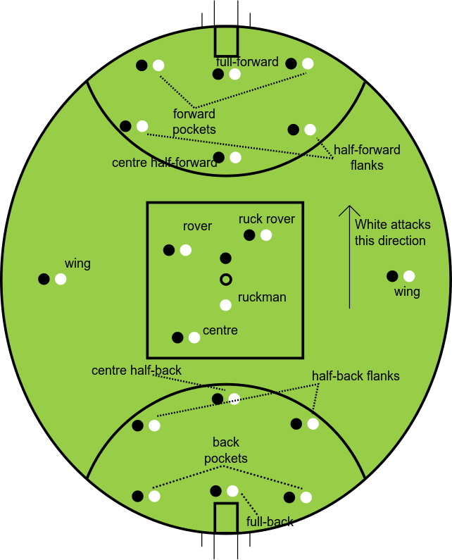
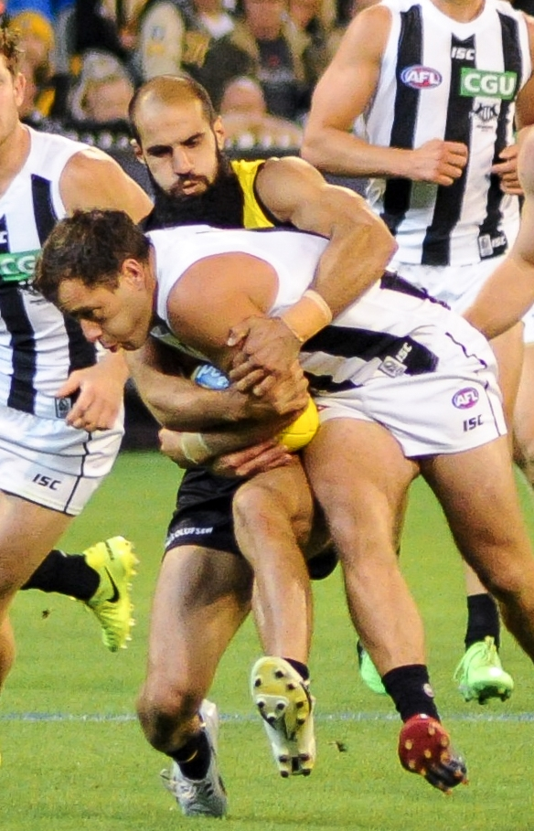
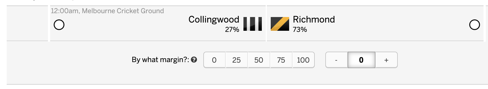
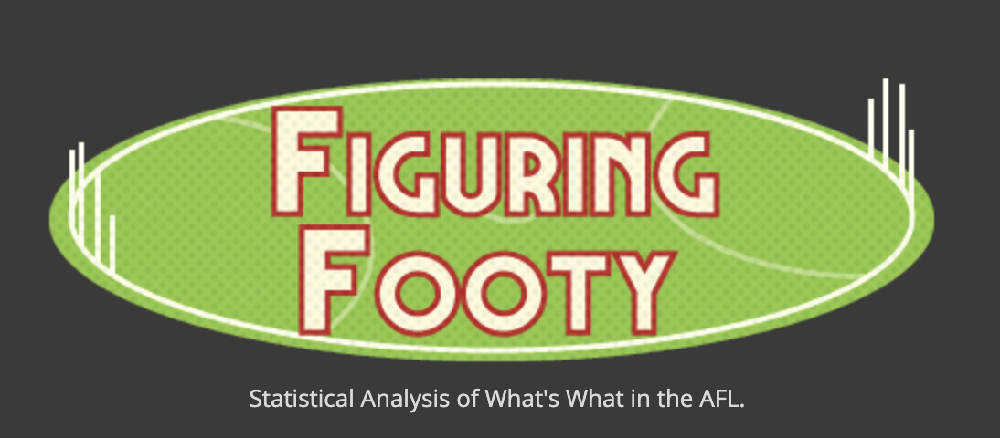
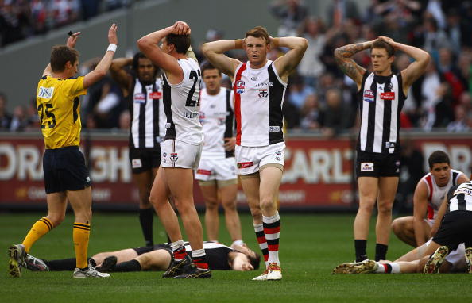
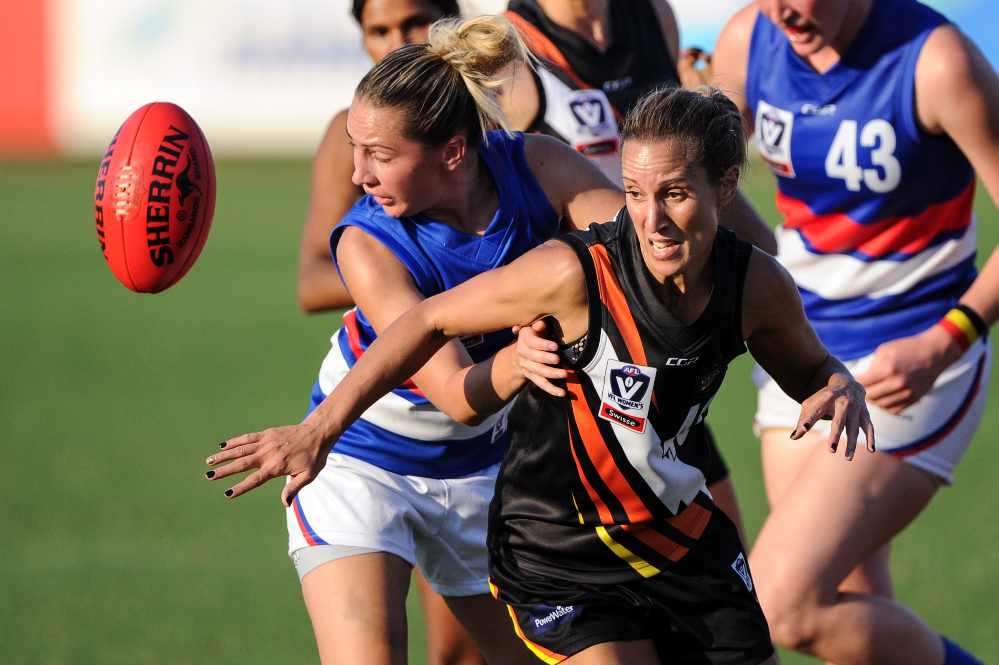

autoscale: true
footer:  @englishcraig


# <br><br>**Machine Learning<br>Outside the Kaggle Lines**

## Craig Franklin<br><br><br><br><br><br>

[.footer:]

---

# About me

:hospital: Developer at Seer Medical

:rugby_football: Recent convert to Aussie Rules Football fandom

 tipresias, cfranklin11

:notebook: craigfranklin.dev

 @englishcraig

[.footer:]

---

# Kaggle is fine

# :thumbsup:

^
- Competitions & learning
- Good for learning
- Level playing field
- Same rules, data, objective

---

# What is footy (tipping)?



[.footer: *Robert Merkel, Jacknstock at English Wikipedia / Public domain*]

---



^
- Australian-rules football: contact sport, oblong ball
- Footy tipping: office betting pool
- Most correct picks wins
- Lots of novel challenges & mistakes, but learned from them

[.footer: _By Unknown author - Fairfax Photo Archives, Public Domain<br>By Flickerd - Own work, CC BY-SA 4.0_<br> @englishcraig]

---

# Clearly define your problem


^
- Footy tipping = picking winners
- Got data, trained the model, built the app
- Unexpected input

[.footer: *Photo by Patrick Tomasso on Unsplash*]

---



^
- Margin of victory for first match is tie breaker
- Had classifier, so manually entered margins
- Next season: changed to regressor for margins

---

# Know the entire life stories<br>of your data sources


^
- Kaggle provide all the data for you
- Collecting data to solve your ML problem is hard
- Dynamic data sources are particularly difficult
- Start of first season, betting odds data were blank
- I panicked & scraped a betting site

[.footer: *Photo by CoWomen on Unsplash*]

---

## Weekly Data Update Schedule

| Day       | Data Types                    | Data Sources  | Notes                                       |
| --------- | ----------------------------- | ------------- | ------------------------------------------- |
| Monday    | Match results<br>Player stats | afltables.com | Sometimes delayed till Tuesday or Wednesday |
| Tuesday   | Betting odds                  | footywire.com |                                             |
| Wednesday | Team rosters                  | afl.com.au    | For Thursday match only                     |
| Thursday  | Team rosters                  | afl.com.au    | For all later matches                       |

^
- Rosters & betting odds change up until the start of each match
- Avoid predictions with blank or stale data
- Observe data sources as you would the data itself

---

# Get by with a little help<br>from your friends

^
- Collecting and cleaning your own data is a lot of work
- Web scrapers & using undocumented APIs are difficult to maintain
- I thought I was clever & original

---




---


### https://github.com/jimmyday12/fitzRoy

^
- fitzRoy: R package for AFL data
- R packages can be good source of data
- More effort upfront, but lower maintenance
- Example: AFL website changing to JS heavy UI

---

# Make your assumptions explicit

^
- What values can be missing? What values are unique?
- Index: team, season, round number

---

## TFW you realise you gotta do it all again next week



^
- 2010: Replay the Grand Final

[.footer: _Getty Images_<br> @englishcraig]

---

# Data bugs could be hiding anywhere


^
- Data bugs are often silent
- Spot checks can catch them, but are time consuming
- Raising errors codifies assumptions about valid data

[.footer: _Photo by Katie Moum on Unsplash_<br> @englishcraig]

---

## When doing datetime-sensitive calculations, make sure your rows are in the correct order

```python
assert data_frame["date"].is_monotonic_increasing, (
    "Data must be sorted by date to calculate cumulative values ",
    "or make predictions with time-series models.",
)

data_frame.groupby(["team", "year"].cumsum("match_wins"))
```

^
- Time-series models (ARIMA, Elo) need data sorted by date/time
- Spent days debugging an Elo model with 50% accuracy

---

## Joining disparate data sets is risky

| Data set                  | First season | # blank seasons |
| ------------------------- | ------------ | --------------- |
| Match results             | 1897         | 0               |
| Player scoring stats      | 1897         | 0               |
| Basic player stats\*      | 1965         | 68              |
| Advanced player stats\*\* | 1999         | 102             |
| Betting odds              | 2010         | 113             |

\*_For basic in-game events like kicks, tackles, etc._
\*\*_For less-common in-game events or ones that require player location._

^
- Different stats start in different years
- Lots of blank values
- Imputing didn't make sense, so decided to fill with 0s
- Caused lots of bugs

---

## Make sure there are no dodgy zeros

```python
data_to_check = data_frame[NEVER_ZERO_COLUMNS]
zeros_data_frame = data_to_check[(data_to_check == 0).any(axis=1)]

assert not zeros_data_frame.any().any(), (
    "An invalid fillna produced index column values of 0:\n"
    f"{zeros_data_frame}"
)
```

^
- When joining data sets & filling with zeros, can't know which zeros are valid
- Some values should never be blank (team, season, round number)
- Assertions important, because you can't test for them, resulting in bad training/predictions

---

# Optimise for maintainability first,<br>accuracy second


^
- Second season: regressor instead of classifier
- Kaggle is temporary: no tech debt
- Project has to be maintained, so make it pleasant to work with

[.footer: *Photo by Cesar Carlevarino Aragon on Unsplash*]

---

## Calculate the cost/benefit of complexity


^
- Kaggle is all about performance
- Project models can be complicated, just weight cost/benefit
- Diminishing returns with increased complexity
- Abandoned first model/app because too messy

[.footer: _Photo by StellrWeb on Unsplash_<br> @englishcraig]

---

# The Joy of Production


[.footer:]

---

## Know your system-level dependencies<br>(or control them)

- Do you need any of the Boost C++ libraries, gcc, or g++?
- Do you need to control your environment with Docker?

^
- Deployed to Heroku
- Crashed because didn't have C library Boost.Python
- Re-architect for Docker

---

## Know your server's specs


^
- Second season: deployed to heroku, crashed
- Player data used too much memory
- Re-architect for DigitalOcean
- Data pipelines & ML models are memory hungry
- Know your data usage & how much your server has

[.footer: _Photo by Jordan Rowland on Unsplash_<br> @englishcraig]

---

# Predicting the bounce<br>of an oblong ball



[.footer: *Flickerd / CC BY-SA (https://creativecommons.org/licenses/by-sa/4.0)*]

---

## 2018 Season Results

| Tipper         | Correct Tips\* |
| -------------- | -------------- |
| Tipresias (me) | 140            |
| Top Coworker   | 139            |
| Oddsmakers     | 140            |

\* _Regular season only_

^
- Rough start, but came back to win in final match

---

## 2019 Season Results

| Tipper         | Correct Tips\* |
| -------------- | -------------- |
| Tipresias (me) | 133            |
| Top Coworker   | 138            |
| Oddsmakers     | 135            |

\* _Regular season only_

^
- Added data, improved model
- Rough start, rough middle, rough finish
- Success isn't guaranteed
- Kaggle has static test set, sport is chaotic and each season is unique
- Random tipper's instinct can beat the odds as well as the machines

---

# Thank you

All the tips:  tipresias.net

All the code:  tipresias

All the slides: :notebook: craigfranklin.dev

All the complaints:  @englishcraig

[.footer:]
